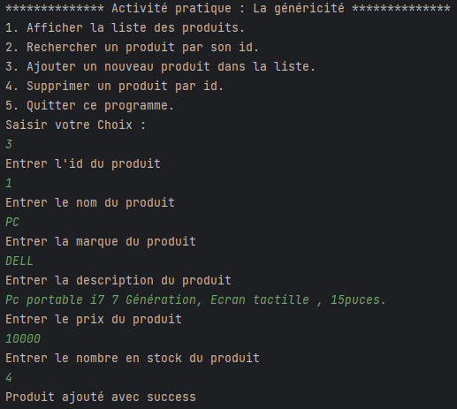

<h1>GENERICS using JAVA</h1>

<h3>1. Afficher la liste des produits.</h3>

<h3>2. Rechercher un produit par son id.</h3>

<h3>3. Ajouter un nouveau produit dans la liste.</h3>

<h3>4. Supprimer un produit par id.</h3>

<h3>5. Quitter ce programme.</h3>

<h3>handle excetion for a case not between 1 & 5 .</h3>

